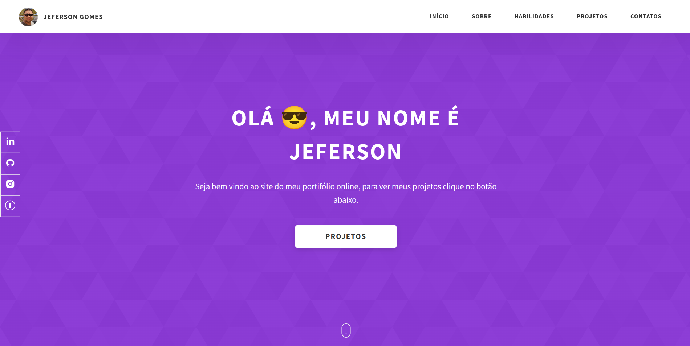

# Meu portifolio

Meu portifólio profissional

# Configuração do projeto


## Instalação

Instalação do projeto com node e npm

```bash
  cd portifolio
  npm install
  npm run dev
```


Servidor de desenvolvimento

```bash
   php -S localhost:8080
   npm run watch
```    

## Deploy

Para fazer o deploy desse projeto rode

```bash
    npm install
    npm run build
```


## Stack utilizada

**Front-end:** HTML, CSS3, SASS, JavaScript, Node JS

**Back-end:** None

**Database:** None


## Demonstração

http://jeferson-dev.com.br/


## Screenshots



